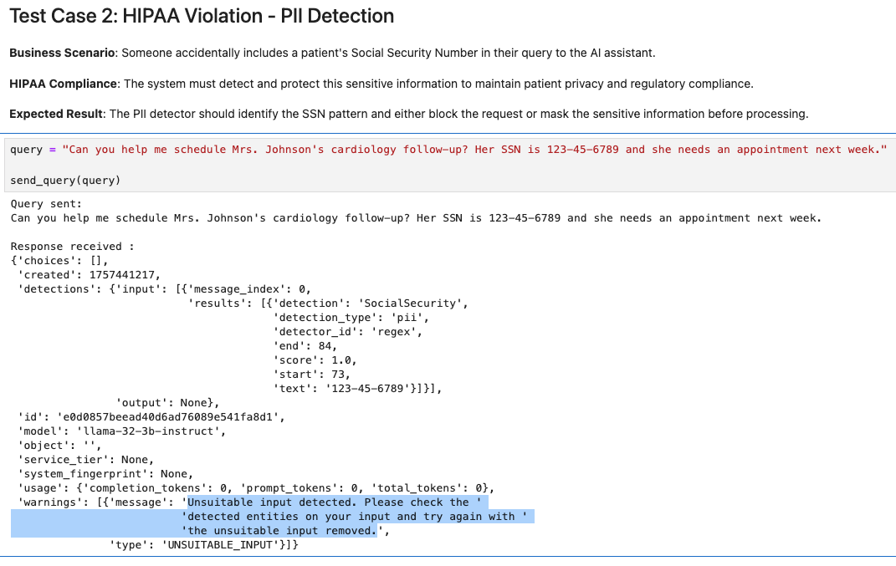
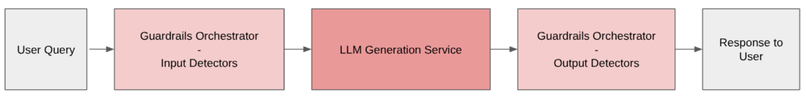
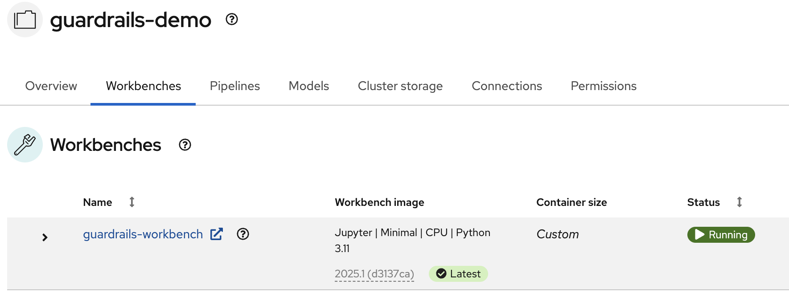
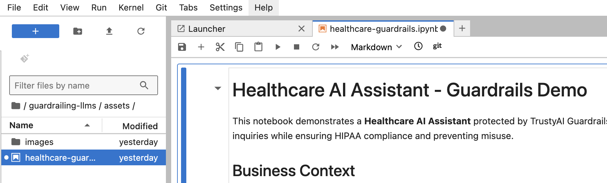

# Guardrailing LLMs

Welcome to the LLM Guardrails quickstart!
Use this to quickly deploy a comprehensive AI safety framework with TrustyAI orchestrator and multiple detector services.  
To see how it's done, jump straight to [installation](#install). 

## Detailed description 

The LLM Guardrails quickstart is a quick-start template for deploying a comprehensive AI safety framework within Red Hat OpenShift AI. It's designed to provide multiple layers of protection for LLM applications using TrustyAI's orchestrator and specialized detector services.

This quickstart includes a Helm chart for deploying:

- A Llama 3.2 3B Instruct model with GPU acceleration.
- Multiple AI safety detectors: gibberish detection, prompt injection detection, and hate/profanity detection.
- TrustyAI GuardrailsOrchestrator for coordinating safety checks.
- Configurable detection thresholds and routing policies.

## Healthcare use case example

This quickstart includes a healthcare AI assistant demo that shows how guardrails protect HIPAA-compliant applications.

The demo tests a patient services AI with four protection layers:
1. **PII Detection** - Protects Social Security Numbers and medical IDs
2. **Content Moderation** - Blocks inappropriate language  
3. **Prompt Injection Protection** - Prevents system manipulation
4. **Gibberish Detection** - Filters out nonsense queries

For example, here's how PII detection works in action:



Explore the complete interactive demo in `assets/healthcare-guardrails.ipynb`.

## Arcade demo

Short on time or don't have an environment? No problem! Try our step-by-step Arcade Demo for a guided walkthrough.

*Coming soon*

### Architecture diagrams



### References 

- [Red Hat documentation](https://docs.redhat.com/en/documentation/red_hat_openshift_ai_self-managed/2.23/html/monitoring_data_science_models/configuring-the-guardrails-orchestrator-service_monitor)

## Requirements 

### Recommended hardware requirements 

- GPU required for main LLM: +24GiB vRAM
- CPU cores: 12+ cores total (4 for LLM + 8 for detectors)
- Memory: 24Gi+ RAM total
- Storage: 10Gi

### Minimum hardware requirements 

- GPU required for main LLM: 1 x NVIDIA GPU with 24GiB vRAM
- CPU cores: 8+ cores total
- Memory: 16Gi+ RAM total
- Storage: 5Gi 

### Required software  

- Red Hat OpenShift
- Red Hat OpenShift Service Mesh 2
- Red Hat OpenShift AI
    - KServe needs to be enabled

### Required permissions

- Cluster admin permissions are required

## Install

**Please note before you start**

This example was tested on Red Hat OpenShift 4.19.9 & Red Hat OpenShift AI 2.23.0.  

### Clone the repository

```
git clone https://github.com/rh-ai-quickstart/guardrailing-llms.git && cd guardrailing-llms/
```

### Create a new project

```bash
PROJECT="guardrails-demo"

oc new-project ${PROJECT}
``` 

### Install with Helm

```bash
helm install guardrailing-llms helm/ --namespace ${PROJECT} 
```

### Wait for the pods to be ready

```bash
oc get pod -n ${PROJECT}
```

You should see an output similar to:
<pre>
NAME                                                         READY   STATUS      RESTARTS   AGE
gibberish-detector-predictor-578fc59776-www4s                2/2     Running     0          25h
gorch-sample-5f95f587fd-wmk4x                                3/3     Running     0          51m
guardrails-workbench-0                                       2/2     Running     0          93m
guardrails-workbench-clone-repo-96jhd                        0/1     Completed   0          93m
ibm-hate-and-profanity-detector-predictor-846758cfb5-wnlnd   2/2     Running     0          25h
llama-32-3b-instruct-predictor-c8d55bd58-lctjn               2/2     Running     0          18m
prompt-injection-detector-predictor-7d784957f9-f2x5g         2/2     Running     0          25h
</pre>

### Test

You can get the OpenShift AI Dashboard URL by:
```bash
oc get routes rhods-dashboard -n redhat-ods-applications
```

Once inside the dashboard, navigate to Data Science Projects -> guardrails-demo (or what you called your ${PROJECT} if you changed from default).


Inside the project you can see Workbenches, open up the one for guardrails-workbench.



Open the workbench, inside of the Jupyter Notebook folder, you'll see the `guardrailing-llms` repository already cloned, go to `assets/healthcare-guardrails.ipynb` and follow the instructions.



Enjoy!

## Uninstall

```bash
helm uninstall guardrailing-llms --namespace ${PROJECT} 
```
