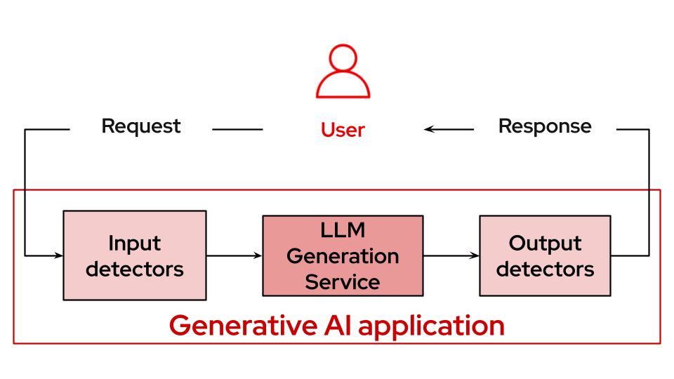

# Guardrailing LLMs

Welcome to the LLM Guardrails quickstart!
Use this to quickly deploy a comprehensive AI safety framework with TrustyAI orchestrator and multiple detector services.  
To see how it's done, jump straight to [installation](#install). 

## Detailed description 

The LLM Guardrails quickstart is a quick-start template for deploying a comprehensive AI safety framework within Red Hat OpenShift AI. It's designed to provide multiple layers of protection for LLM applications using TrustyAI's orchestrator and specialized detector services.

This quickstart includes a Helm chart for deploying:

- A Llama 3.2 3B Instruct model with GPU acceleration.
- Multiple AI safety detectors: gibberish detection, prompt injection detection, and hate/profanity detection.
- TrustyAI GuardrailsOrchestrator for coordinating safety checks.
- Configurable detection thresholds and routing policies.

## Healthcare Use Case Example

This quickstart includes a healthcare AI assistant demo that shows how guardrails protect HIPAA-compliant applications.

The demo tests a patient services AI with four protection layers:
1. **PII Detection** - Protects Social Security Numbers and medical IDs
2. **Content Moderation** - Blocks inappropriate language  
3. **Prompt Injection Protection** - Prevents system manipulation
4. **Gibberish Detection** - Filters out nonsense queries

See the interactive demo in `assets/healthcare-guardrails.ipynb`.

### Architecture diagrams



### References 

- [Red Hat documentation](https://docs.redhat.com/en/documentation/red_hat_openshift_ai_self-managed/2.23/html/monitoring_data_science_models/configuring-the-guardrails-orchestrator-service_monitor)

## Requirements 

### Recommended hardware requirements 

- GPU required for main LLM: +24GiB vRAM
- CPU cores: 12+ cores total (4 for LLM + 8 for detectors)
- Memory: 24Gi+ RAM total
- Storage: 10Gi

### Minimum hardware requirements 

- GPU required for main LLM: 1 x NVIDIA GPU with 16GB+ VRAM  
- CPU cores: 8+ cores total
- Memory: 16Gi+ RAM total
- Storage: 5Gi 

### Required software  

- Red Hat OpenShift 4.16+
- Red Hat OpenShift AI 2.23
- Dependencies for [Guardrails Operator](https://docs.redhat.com/en/documentation/red_hat_openshift_ai_self-managed/2.23/html/monitoring_data_science_models/configuring-the-guardrails-orchestrator-service_monitor)

### Required permissions

- Standard user. No elevated cluster permissions required

## Install

**Please note before you start**

This example was tested on Red Hat OpenShift 4.19.9 & Red Hat OpenShift AI 2.23.0.  

### Clone

```
git clone https://github.com/rh-ai-quickstart/guardrailing-llms.git && cd guardrailing-llms/  
```

### Create the project

```bash
PROJECT="guardrails-demo"

oc new-project ${PROJECT}
``` 

### Check 

### Install with Helm

```bash
helm install guardrailing-llms helm/ --namespace ${PROJECT} 
```

## Uninstall

```bash
helm uninstall guardrailing-llms --namespace ${PROJECT} 
```
